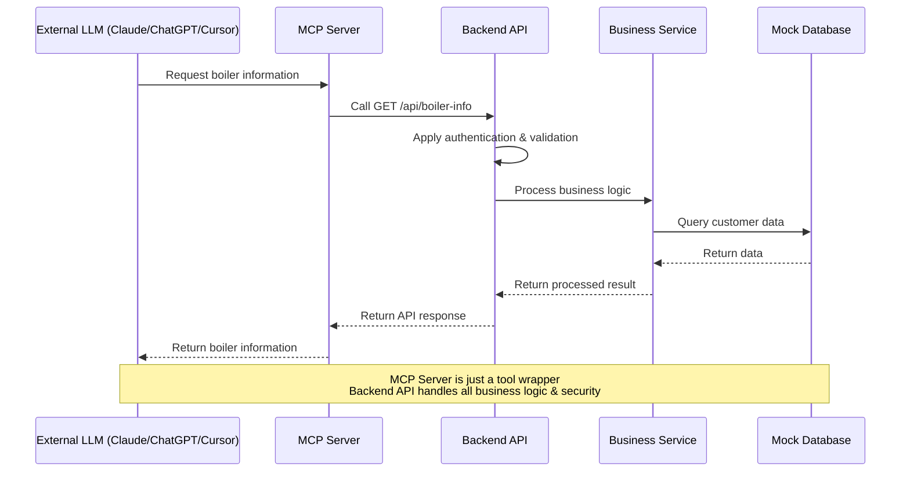

# Agentic Workflow Protocol (AWP)

## Init

1. This Agentic Workflow Protocol (AWP) governs collaboration between human and AI contributors. The following principles must always be followed:

  1.1. All work is guided strictly by the AWP; no deviations or improvisation.

  1.2. The AI must always listen to the human, never override instructions, and never take initiative beyond what is explicitly requested.

  1.3. Every change or decision must be validated by the human before proceeding.

  1.4. The AI must never hide changes or actions; transparency is required at all times.

  1.5. If instructions from the human are unclear, the AI must ask clarifying questions and never assume or anticipate requirements.

  1.6. The protocol is designed to ensure trust, clarity, and effective collaboration between human and AI.

## Author

1. Michael Wybraniec

## Goal

<!-- What is the main objective of this project? -->
1. The main objective of this project is to demonstrate how MCP Server can work with LLM chatbots (Claude, ChatGPT, etc.). The MCP Server will provide boiler maintenance and sales tools that the chatbot can use to:
   - Get customer household boiler information and model details
   - Check maintenance schedules and recommend auto-maintenance subscriptions
   - Show available boilers in stock with comparisons
   - Process purchase requests and payments
   - Send confirmation emails

**Important Note:** This is a demonstration project. The MCP Server will be provided to external chatbots for testing. All external services (APIs, payment gateways, databases, email services) will be mocked using JSON files to showcase the MCP Server integration capabilities without requiring real backend infrastructure.

## Technology Stack

### MCP Server & Backend Architecture
- **Runtime**: Node.js with TypeScript
- **MCP Server**: Simple tool wrapper that calls backend API
- **Backend API**: RESTful API with all business logic and security
- **Mock Backend**: Business logic services with security controls
- **Mock Database**: JSON files with data access controls
- **Security**: Handled entirely by the backend API

### Development & Infrastructure
- **Package Manager**: npm or pnpm
- **Testing**: Basic testing with Node.js
- **Linting**: ESLint + Prettier
- **Type Safety**: TypeScript

### External Chatbot Integration
- **Target Platforms**: Claude, ChatGPT, or any MCP-compatible chatbot
- **Integration**: MCP Server will be provided as a tool to the chatbot
- **Testing**: Manual testing with different LLM platforms
- **No Frontend Required**: The MCP Server is a backend service only

### Project Structure (MCP + Backend API)
```
mcp-in-chat/
├── src/
│   ├── mcp/                   # MCP Server (Tool Wrapper)
│   │   ├── tools/             # MCP tools that call backend API
│   │   │   ├── boiler-info.ts # Calls GET /api/boiler-info
│   │   │   ├── maintenance.ts # Calls GET/POST /api/maintenance
│   │   │   ├── purchase.ts    # Calls POST /api/purchase (includes inventory)
│   │   │   └── email.ts       # Calls POST /api/send-email
│   │   └── mcp-server.ts      # Main MCP server entry point
│   ├── api/                   # Backend API (All Business Logic)
│   │   ├── routes/            # API endpoints
│   │   │   ├── boiler-info.ts
│   │   │   ├── maintenance.ts
│   │   │   ├── inventory.ts
│   │   │   ├── purchase.ts
│   │   │   └── email.ts
│   │   ├── middleware/        # Security & validation
│   │   │   ├── auth.ts        # Authentication
│   │   │   ├── validation.ts  # Input validation
│   │   │   └── rate-limit.ts  # Rate limiting
│   │   ├── services/          # Business logic services
│   │   │   ├── customer-service.ts
│   │   │   ├── boiler-service.ts
│   │   │   ├── payment-service.ts
│   │   │   └── email-service.ts
│   │   └── server.ts          # Express API server
│   └── types/                 # TypeScript definitions
├── data/                      # Mock Database
│   ├── customers.json
│   ├── boilers.json
│   ├── maintenance.json
│   ├── inventory.json
│   └── orders.json
├── package.json
├── tsconfig.json
└── README.md
```

### System Architecture Diagram


### Data Flow Architecture



## Overview (3-Hour Timeline)

<!-- List the main phases or milestones of your project -->

### 1. Project Setup & Backend API (45 minutes)
1.1. Initialize Node.js project with TypeScript
1.2. Set up Express API server with security middleware
1.3. Create mock JSON data files
1.4. Define TypeScript interfaces for API endpoints

### 2. Backend API Development (90 minutes)
2.1. Implement boiler information API endpoint (GET /api/boiler-info)
2.2. Implement maintenance API endpoints (GET/POST /api/maintenance)
2.3. Implement purchase API endpoint (POST /api/purchase - includes inventory)
2.4. Implement email API endpoint (POST /api/send-email)

### 3. MCP Server Development (45 minutes)
3.1. Implement MCP Server with tool wrappers
3.2. Create MCP tools that call backend API endpoints
3.3. Test MCP Server with local API
3.4. Create demo instructions for chatbot integration

### 4. External Chatbot Integration (60 minutes)
4.1. Test MCP Server with Claude (if available)
4.2. Test MCP Server with ChatGPT (if available)
4.3. Document integration process and results
4.4. Create demo presentation materials

## Outcome

<!-- What does success look like? -->

### Demo-Ready MCP Server
1. **Working MCP Server** with 4 focused boiler maintenance and sales tools:
   - Boiler information retrieval tool
   - Maintenance scheduling and subscription tool
   - Purchase processing tool (includes inventory)
   - Email confirmation tool

### Backend API Infrastructure
2. **Complete Backend API** with all business logic:
   - 4 RESTful API endpoints with security middleware
   - Mock JSON database with realistic boiler data
   - Authentication, validation, and rate limiting
   - Business logic services for customer management

### Integration & Testing
3. **External Chatbot Integration**:
   - MCP Server successfully connects to at least one external chatbot (Claude/ChatGPT/Cursor)
   - Demonstrable conversation flow showing tool usage
   - Working demo with sample customer scenarios

### Documentation & Presentation
4. **Complete Documentation**:
   - Setup instructions for running the demo
   - API documentation for all endpoints
   - Sample conversation flows and use cases
   - Demo presentation materials

### Success Criteria
- ✅ MCP Server starts and exposes all 4 tools
- ✅ Backend API responds to all tool requests
- ✅ External chatbot can successfully use the tools
- ✅ Demo shows realistic boiler maintenance scenarios
- ✅ All mock data and services work as expected
- ✅ Presentation demonstrates MCP Server integration value

**Note**: This is a demonstration project focused on showcasing MCP Server capabilities, not a production-ready system.

## Demo Scenarios

### Scenario 1: Boiler Information
**User**: "What's the warranty status of my boiler?"
**Chatbot**: Uses Boiler Info Tool to retrieve customer boiler details and warranty information

### Scenario 2: Maintenance Scheduling
**User**: "I need to schedule maintenance for my boiler"
**Chatbot**: Uses Maintenance Tool to check schedule, consider weather, and book service

### Scenario 3: Boiler Upgrade
**User**: "I want to upgrade my boiler to a more efficient model"
**Chatbot**: Uses Purchase Tool to show inventory, compare models, and process order

### Scenario 4: Emergency Service
**User**: "My boiler is making strange noises, I need help"
**Chatbot**: Uses Maintenance Tool to schedule emergency service and Email Tool to send confirmation

## Risk Mitigation

### External Chatbot Access
- **Plan A**: Test with Claude, ChatGPT, or Cursor
- **Plan B**: Use local testing with MCP client tools
- **Plan C**: Record demo video for presentation

### Time Overrun
- **Priority 1**: Core MCP tools (boiler info, maintenance)
- **Priority 2**: Purchase and email tools
- **Priority 3**: Enhanced features (weather, AI predictions)

### Technical Issues
- **Fallback**: Local testing with curl/Postman
- **Documentation**: Comprehensive troubleshooting guide
- **Support**: Clear error messages and logging

## Demo Success Metrics

- ✅ MCP Server connects to external chatbot
- ✅ All 4 tools respond correctly
- ✅ Complete conversation flow demonstrated
- ✅ Audience understands MCP Server value
- ✅ Demo runs smoothly without technical issues

## Collaboration

- **ai_agent_senior_developer:** Senior Developer (AI Agent)
- **ai_agent_junior_developer:** Junior Developer (AI Agent)
- **ai_agent_designer:** Designer (AI Agent)
- **ai_agent_tester:** Tester (AI Agent)
- **ai_agent_documentation:** Documentation (AI Agent)
- **ai_agent_project_manager:** Project Manager (AI Agent)
- **ai_agent_product_owner:** Product Owner (AI Agent)
- **ai_agent_scrum_master:** Scrum Master (AI Agent)
- **human_developer:** Developer (Human)
- **human_designer:** Designer (Human)
- **human_tester:** Tester (Human)
- **human_documentation:** Documentation (Human)
- **human_project_manager:** Project Manager (Human)
- **human_product_owner:** Product Owner (Human)
- **human_scrum_master:** Scrum Master (Human)
- **approver:** Human Only (Human)
- **approval_timeout:** 10 minutes
- **auto_handoff:** true

## Project Backlog

### 1. Project Foundation & Setup (45 minutes)
- [x] 1.1: Create package.json with name "mcp-in-chat", version "1.0.0", type "module"
- [x] 1.2: Install dependencies: express, @modelcontextprotocol/sdk, typescript, @types/node, @types/express
- [x] 1.3: Create tsconfig.json with target ES2022, module ESNext, strict mode enabled
- [x] 1.4: Create project folder structure: src/mcp/tools, src/api/routes, src/api/middleware, src/api/services, data
- [x] 1.5: (MOCK) Create data/customers.json with sample customer data (name, email, address, boiler model, install date)
- [x] 1.6: (MOCK) Create data/boilers.json with boiler catalog (model, manufacturer, efficiency, price, features, warranty_info)
- [x] 1.7: (MOCK) Create data/maintenance.json with maintenance schedules (customer_id, last_service, next_service, status, ai_predictions)
- [x] 1.8: (MOCK) Create data/inventory.json with available boilers in stock (model, quantity, location, price)
- [x] 1.9: (MOCK) Create data/orders.json with purchase orders (customer_id, boiler_model, order_date, status, total)
- [x] 1.10: (MOCK) Create data/weather.json with mock weather data for maintenance scheduling
- [x] 1.11: (MOCK) Create data/technicians.json with mock technician availability and skills
- [x] 1.12: (MOCK) Create data/warranties.json with mock warranty information by manufacturer and model
- [x] 1.13: Create src/types/index.ts with TypeScript interfaces for Customer, Boiler, Maintenance, Inventory, Order, Weather, Technician, Warranty

### 2. Backend API Development (90 minutes)
- [x] 2.1: Create src/api/server.ts with Express server setup, CORS, JSON middleware
- [x] 2.2: (MOCK) Create src/api/middleware/auth.ts with mock API key validation (check for "demo-key" header)
- [x] 2.3: Create src/api/middleware/validation.ts with input validation using express-validator
- [x] 2.4: Create src/api/middleware/rate-limit.ts with rate limiting (100 requests per hour per IP)
- [x] 2.5: (MOCK) Create src/api/services/customer-service.ts with functions to read/write customer data from JSON
- [x] 2.6: (MOCK) Create src/api/services/boiler-service.ts with functions to read boiler catalog and inventory
- [x] 2.7: (MOCK) Create src/api/services/payment-service.ts with mock payment processing (always returns success)
- [x] 2.8: (MOCK) Create src/api/services/email-service.ts with mock email sending (logs to console)
- [ ] 2.9: (MOCK) Create src/api/services/weather-service.ts with mock weather data for maintenance scheduling
- [ ] 2.10: (MOCK) Create src/api/services/warranty-service.ts with mock warranty information from manufacturers
- [ ] 2.11: (MOCK) Create src/api/services/ai-prediction-service.ts with mock AI predictions for maintenance needs
- [ ] 2.12: (MOCK) Create src/api/services/technician-service.ts with mock technician availability and scheduling
- [ ] 2.13: Create src/api/routes/boiler-info.ts with GET /api/boiler-info endpoint (returns customer boiler details + warranty info)
- [ ] 2.14: Create src/api/routes/maintenance.ts with GET /api/maintenance (get schedule) and POST /api/maintenance (schedule service with weather + AI predictions)
- [ ] 2.15: Create src/api/routes/purchase.ts with POST /api/purchase endpoint (process order with inventory check + technician scheduling)
- [ ] 2.16: Create src/api/routes/email.ts with POST /api/send-email endpoint (send confirmation emails)
- [ ] 2.17: Register all routes in server.ts with proper middleware chain (auth -> validation -> rate-limit -> route)
- [ ] 2.18: Test all API endpoints with curl or Postman to ensure they return proper JSON responses
- [ ] 2.19: Create src/api/index.ts to export the Express app for testing

### 3. MCP Server Development (45 minutes)
- [ ] 3.1: Create src/mcp/mcp-server.ts with MCP server setup using @modelcontextprotocol/sdk
- [ ] 3.2: Create src/mcp/tools/boiler-info.ts with MCP tool that calls GET /api/boiler-info with customer_id parameter
- [ ] 3.3: Create src/mcp/tools/maintenance.ts with MCP tool that calls GET/POST /api/maintenance with customer_id and service_date
- [ ] 3.4: Create src/mcp/tools/purchase.ts with MCP tool that calls POST /api/purchase with customer_id, boiler_model, payment_info
- [ ] 3.5: Create src/mcp/tools/email.ts with MCP tool that calls POST /api/send-email with to_email, subject, message
- [ ] 3.6: Register all 4 MCP tools in mcp-server.ts with proper tool descriptions and parameter schemas
- [ ] 3.7: Create src/mcp/index.ts to export the MCP server for external connections
- [ ] 3.8: Test MCP server locally by starting it and verifying tools are registered correctly
- [ ] 3.9: Create test script to verify each MCP tool can be called and returns expected responses
- [ ] 3.10: Create package.json scripts: "start:api" for backend API, "start:mcp" for MCP server

### 4. External Integration & Demo (60 minutes)
- [ ] 4.1: Create docs/setup.md with step-by-step instructions to run the demo
- [ ] 4.2: Create docs/api-endpoints.md with all 4 API endpoints documentation (URL, method, parameters, response)
- [ ] 4.3: Create docs/mcp-tools.md with all 4 MCP tools documentation (name, description, parameters, examples)
- [ ] 4.4: Create demo/conversation-flows.md with sample chatbot conversations using each MCP tool
- [ ] 4.5: Test MCP server with Claude by providing server connection details and testing each tool
- [ ] 4.6: Test MCP server with ChatGPT by providing server connection details and testing each tool
- [ ] 4.7: Test MCP server with Cursor by providing server connection details and testing each tool
- [ ] 4.8: Create demo/presentation.md with key points to demonstrate MCP Server integration value
- [ ] 4.9: Create README.md with project overview, setup instructions, and demo guide
- [ ] 4.10: Record demo video showing MCP Server integration with external chatbot
- [ ] 4.11: Create troubleshooting.md with common issues and solutions
- [ ] 4.12: Final testing: ensure both API and MCP server start correctly and all tools work

## Unplanned Tasks

- [ ] 1.1: Unplanned task, Name, Title, Description, etc.
- [ ] 1.2: Unplanned task, Name, Title, Description, etc.

## Procedures

update

1.1. Review README.md and AWP.md after each step.

1.2. Update README.md to reflect the current state

1.3. We review AWP.md to understand next actions.

1.4. Check for blockers, if any we notify humans.

1.5. Ensure docs and code are aligned, of not, notify humans.

commit

2.1. Commit changes using the commitStandard.

2.2. Use the format: type(scope step): subject.

2.3. Reference the step number in every commit message.

2.4. Follow conventional commit standards.

2.5. Include relevant files.

next

3.1. Move to the next actionable step only after update and commit are complete.

3.2. Identify the next actionable step and begin work.

3.3. Check for blockers before proceeding, and confirm additional plan with human.

3.4. Mark the current step 'check' [ ] as done before you start like that [x].

check

4.1. Review AWP.md to determine the current actionable step.

4.2. Find the first step not done.

4.3. Restore context and understand what needs to be done.

4.4. Use this when returning to work after a break or context loss.

handoff

5.1. Transfer task ownership between human and AI.

5.2. Package current context and deliverables.

5.3. Notify receiving party with clear expectations.

5.4. Set timeout for response and escalation rules.

## Notes

-
-
-
-

## Commit Standard

- **format:** type(scope step): subject
- **types:** feat, fix, docs, test, chore
- **rules:**
  - Reference the step in every commit.
  - Use imperative mood.
  - Keep messages concise and descriptive.
- **examples:**
  - feat(api 3.1): add API endpoint
  - docs(readme 5.1): expand documentation
